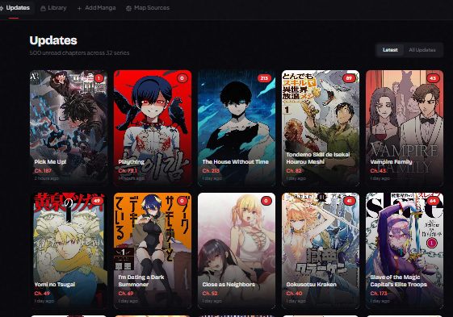
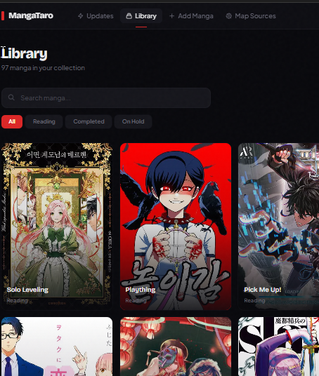
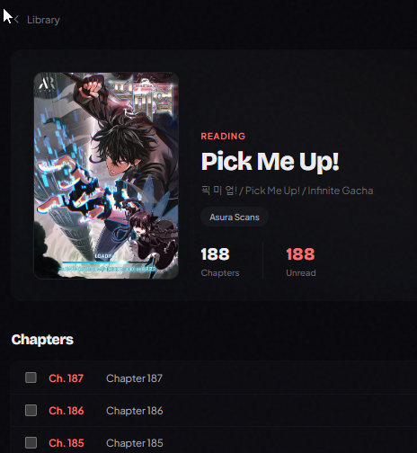
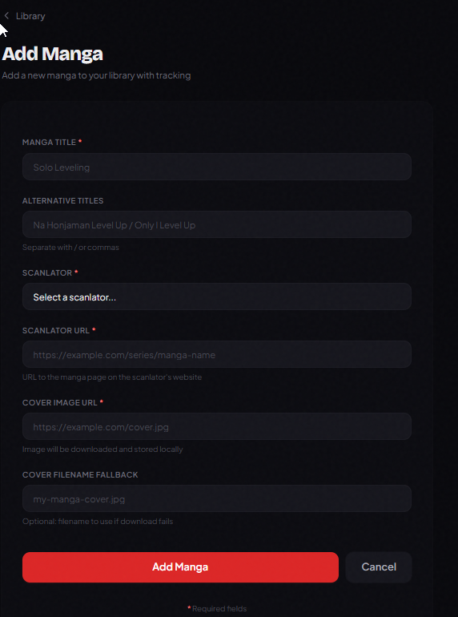

# MangaTaro User Guide

Complete guide to using MangaTaro for tracking manga chapters.

## Table of Contents

- [Web Interface Overview](#web-interface-overview)
- [Checking for New Chapters](#checking-for-new-chapters)
- [Supported Scanlators](#supported-scanlators)
- [Managing Your Library](#managing-your-library)
- [NSFW Filtering](#nsfw-filtering)
- [Adding New Manga](#adding-new-manga)
- [Mapping Manga to Scanlators](#mapping-manga-to-scanlators)
- [Discord Notifications](#discord-notifications)
- [Common Tasks](#common-tasks)
- [Troubleshooting](#troubleshooting)

---

## Web Interface Overview

MangaTaro provides a clean, modern web interface for tracking your manga collection.

**Main Pages:**
- **Homepage (/)** - Updates feed showing new chapters
- **Library (/library)** - Grid view of your manga collection
- **Manga Detail (/manga/{id})** - Chapter list for specific manga
- **Admin Pages (/admin/*)** - Manage manga and scanlator mappings

**Navigation:** Use the top menu to switch between pages.

---

## Checking for New Chapters

### Homepage Updates Feed

Navigate to: **http://localhost:4343/**



**What you see:**
- **Manga Cover** - Visual identification
- **Manga Title** - Clickable link to manga detail page
- **Chapter Number & Title** - What's new
- **Release Date** - When scanlator posted it
- **Detected Date** - When MangaTaro discovered it
- **"Mark as Read" Button** - One-click to mark chapter read
- **Chapter Link** - Direct link to read on scanlator site

**Using the Feed:**

1. **Scroll through updates** - All unread chapters across your collection
2. **Click manga title** - View all chapters for that manga
3. **Click chapter link** - Opens scanlator website to read
4. **Mark as read** - Click button after reading

**Filtering Updates:**

- **Search bar** - Type manga title to filter
- **Status filter** - Show all, unread only, or read only
- **Sort** - By detected date (newest first)

### Real-Time Updates

New chapters appear automatically when tracking runs. No need to refresh!

---

## Supported Scanlators

MangaTaro currently supports the following scanlation websites:

### AsuraScans
- **URL:** https://asura-scans.com
- **Status:** ✅ Fully functional
- **Language:** English
- **Content:** Popular manga and manhwa

### RavenScans
- **URL:** https://ravenscans.com
- **Status:** ✅ Fully functional
- **Language:** English
- **Content:** Manga and manhwa

### MadaraScans
- **URL:** https://madarascans.com
- **Status:** ⚠️ Plugin complete, experiencing timeout issues
- **Language:** English/Spanish
- **Content:** Manga and manhwa
- **Note:** Site may load slowly or have anti-bot measures. Increase timeout if needed.

**Adding More Scanlators:**

New scanlator plugins can be added by creating a plugin class in `/data/mangataro/scanlators/`. See `template.py` for the structure.

---

## Managing Your Library

### Library Grid View

Navigate to: **http://localhost:4343/library**



**Features:**
- **Cover images** for visual browsing
- **Manga titles** below each cover
- **Grid layout** for easy scanning
- **Search functionality** to find specific manga

**Using the Library:**

1. **Browse visually** - See all your manga at a glance
2. **Search** - Type in search bar to filter by title
3. **Click any manga** - Opens detail page with chapters

### Manga Detail Page

Click any manga to see its detail page:



**What you see:**
- **Cover image and title**
- **Description** (if available)
- **Scanlator sources** - Which sites track this manga
- **Complete chapter list** - All chapters with read/unread status
- **Bulk actions** - Mark all as read

**Using the Detail Page:**

1. **View all chapters** - Complete list sorted by number
2. **Mark individual chapters** - Click "Mark as Read" on any chapter
3. **Mark all read** - Bulk action button at top
4. **Open chapters** - Click chapter link to read on scanlator site
5. **Mark as NSFW** - Toggle button next to status to flag adult content

---

## NSFW Filtering

MangaTaro includes filtering to hide manga with adult/NSFW (Not Safe For Work) content.

### Marking Manga as NSFW

**On Manga Detail Page:**

1. Navigate to any manga detail page
2. Find the NSFW toggle button next to the status label
3. Click **"Mark as NSFW"** - button turns red
4. Click again to unmark - button turns gray

**Button States:**
- **Gray button** ("Mark as NSFW") - Manga is not flagged as NSFW
- **Red button** ("NSFW") - Manga is flagged as NSFW

### Filtering NSFW Content

**Library and Updates Pages:**

Both the Library and Updates pages have a **"Show NSFW"** toggle switch.

**Default Behavior (Safer):**
- Toggle is **OFF** by default
- NSFW manga are **hidden** from view
- Provides a safe browsing experience

**Showing NSFW Content:**
- Toggle the **"Show NSFW"** switch to ON
- NSFW manga appear with a **red "NSFW" badge**
- Badge appears at top-left of manga cover

**Features:**
- **Global setting** - Toggle state applies to both Library and Updates pages
- **Persistent** - Setting saved in browser, survives page refreshes
- **Instant filtering** - No page reload needed
- **Visual indicator** - Red badge clearly marks NSFW manga when shown

**Usage Tips:**
- Hide NSFW by default for safe browsing (especially in shared spaces)
- Toggle ON when browsing privately
- Use to organize adult content separately from general manga

---

## Adding New Manga

There are two ways to add manga:

1. **New manga + scanlator mapping** - Use /admin/add-manga
2. **Existing manga, new scanlator** - Use /admin/map-sources

### Adding New Manga (Recommended)

Navigate to: **http://localhost:4343/admin/add-manga**



**Form Fields:**

1. **Title** (required)
   - Manga name as you want it displayed
   - Example: "Solo Leveling"
   - System checks for duplicates

2. **Alternative Titles** (optional)
   - Comma-separated list of alt names
   - Example: "나 혼자만 레벨업, I Level Up Alone"
   - Helps with searching

3. **Scanlator** (required)
   - Select from dropdown
   - Only shows scanlators with plugins (AsuraScans, RavenScans, etc.)

4. **Scanlator URL** (required)
   - Direct URL to manga on scanlator's website
   - Example: "https://**********/series/solo-leveling"
   - **Validated by scraping** - Must be correct!

5. **Cover URL** (optional)
   - Direct link to cover image (JPEG/PNG)
   - Will be downloaded to `data/img/`
   - If blank, uses scanlator's cover

6. **Cover Filename** (optional)
   - If you already have cover in `data/img/`
   - Example: "solo-leveling.jpg"
   - Use instead of Cover URL

**What Happens:**

1. System validates scanlator URL by actually scraping it
2. Cover image downloaded (if URL provided)
3. Manga entry created in database
4. Scanlator mapping created and marked verified
5. You're redirected to manga detail page
6. First tracking runs automatically

**Common Errors:**

- **"Manga already exists"** - This title is in database, use /admin/map-sources instead
- **"URL validation failed"** - Scanlator URL is incorrect or plugin can't scrape it
- **"Duplicate scanlator URL"** - This URL is already mapped to another manga

---

## Mapping Manga to Scanlators

If manga exists but needs additional scanlator source:

Navigate to: **http://localhost:4343/admin/map-sources**


**Steps:**

1. **Select scanlator** from dropdown (defaults to AsuraScans)
2. **See list of unmapped manga** for that scanlator
3. **Enter scanlator URL** for each manga you want to track
4. **Click "Add"** - URL is validated automatically
5. **Row fades out** on success
6. **Switch scanlators** to map manga from other sources

**When to use this:**
- Manga exists in database
- You want to add another scanlator source
- Multiple scanlators publish same manga

**When NOT to use this:**
- Manga doesn't exist yet → Use /admin/add-manga instead

---

## Discord Notifications

Get notifications when new chapters are detected!

### Setup

1. **Create Discord Webhook:**
   - Open Discord server settings
   - Go to Integrations → Webhooks
   - Click "New Webhook"
   - Name it "MangaTaro"
   - Copy webhook URL

2. **Add to MangaTaro:**
   - Edit `.env` file
   - Set `NOTIFICATION_TYPE=discord`
   - Set `DISCORD_WEBHOOK_URL=https://discord.com/api/webhooks/YOUR_WEBHOOK_URL`
   - Restart API: `sudo systemctl restart mangataro-api`

3. **Test:**
   ```bash
   curl -X POST http://localhost:8008/api/tracking/trigger \
     -H "Content-Type: application/json" \
     -d '{"notify": true}'
   ```

### What You'll Receive

Notifications include:
- Manga title
- New chapter numbers
- Links to chapters on scanlator site
- Cover image (if available)

### Customizing Notifications

Edit notification preferences in `.env`:
- `NOTIFICATION_TYPE` - Set to "discord" or "none"
- Only new chapters trigger notifications (not re-detected chapters)

---

## Common Tasks

### Marking Chapters as Read

**Individual chapter:**
1. Go to homepage or manga detail page
2. Find the chapter
3. Click "Mark as Read" button
4. Status updates immediately

**All chapters for a manga:**
1. Go to manga detail page
2. Click "Mark All Read" button at top
3. Confirms all chapters marked

**Unmark as read:**
1. Go to manga detail page
2. Find chapter marked as read
3. Click "Mark as Unread" button

### Managing NSFW Content

**Mark manga as NSFW:**
1. Visit manga detail page
2. Click "Mark as NSFW" button next to status
3. Button turns red to confirm

**Unmark manga as NSFW:**
1. Visit manga detail page
2. Click red "NSFW" button
3. Button turns gray to confirm removal

**Hide NSFW manga:**
1. Visit Library or Updates page
2. Ensure "Show NSFW" toggle is OFF (default)
3. NSFW manga are hidden from view

**Show NSFW manga:**
1. Visit Library or Updates page
2. Toggle "Show NSFW" switch to ON
3. NSFW manga appear with red badges

**Note:** Toggle state is saved automatically and syncs across both Library and Updates pages.

### Checking Tracking Status

**View recent tracking jobs:**

Visit: http://localhost:8008/api/tracking/jobs

Shows:
- Job ID
- Status (running, completed, failed)
- Start time
- Completion time
- Results (manga tracked, new chapters found, errors)

**Trigger manual tracking:**

```bash
# Via API
curl -X POST http://localhost:8008/api/tracking/trigger

# Via command line
cd /data/mangataro
source .venv/bin/activate
python scripts/track_chapters.py
```

### Viewing Logs

**Tracking logs:**
```bash
# Latest tracking log
tail -f /data/mangataro/logs/track_chapters_*.log

# All tracking logs
ls -lh /data/mangataro/logs/
```

**API logs:**
```bash
# If using systemd
sudo journalctl -u mangataro-api -f

# Last 100 lines
sudo journalctl -u mangataro-api -n 100
```

**Frontend logs:**
```bash
# If using systemd
sudo journalctl -u mangataro-frontend -f
```

### Searching Your Collection

**On Homepage:**
- Use search bar at top
- Type manga title
- Updates filter in real-time

**On Library:**
- Use search bar at top
- Type manga title or alternative title
- Grid updates in real-time

### Managing Cover Images

**Cover images location:** `/data/mangataro/data/img/`

**Add missing covers:**
1. Download image (JPEG/PNG)
2. Name it descriptively (e.g., "solo-leveling.jpg")
3. Place in `data/img/`
4. Update manga via API or database:
   ```sql
   UPDATE mangas SET cover_url='/static/covers/solo-leveling.jpg' WHERE id=X;
   ```

**Frontend symlink:**
The frontend has a symlink: `frontend/public/manga/ → /data/mangataro/data/img/`

This lets covers be served as: `http://localhost:4343/manga/filename.jpg`

---

## Troubleshooting

### Chapters Not Appearing

**Problem:** Tracking runs but no new chapters show up

**Solutions:**
1. Check manga-scanlator mapping is verified:
   ```bash
   mysql -u mangataro_user -p mangataro -e \
     "SELECT * FROM manga_scanlator WHERE manga_id=X;"
   ```
   If `manually_verified=0`, update it:
   ```bash
   mysql -u mangataro_user -p mangataro -e \
     "UPDATE manga_scanlator SET manually_verified=1 WHERE id=Y;"
   ```

2. Check scanlator class_name is correct:
   ```bash
   mysql -u mangataro_user -p mangataro -e \
     "SELECT id, name, class_name FROM scanlators;"
   ```
   Must match plugin class name exactly (e.g., "AsuraScans" not "asurascans")

3. Run tracking with visible browser to debug:
   ```bash
   python scripts/track_chapters.py --manga-id X --visible
   ```

### "Mark as Read" Not Working

**Problem:** Button click doesn't update status

**Solutions:**
1. Check browser console for errors (F12 → Console tab)
2. Verify API is running: `curl http://localhost:8008/health`
3. Check CORS settings in `.env`: `CORS_ORIGINS=http://localhost:4343`
4. Hard refresh browser: Ctrl+Shift+R (clears cache)

### Missing Cover Images

**Problem:** Covers show as broken images

**Solutions:**
1. Check image file exists:
   ```bash
   ls -lh /data/mangataro/data/img/
   ```

2. Check frontend symlink is correct:
   ```bash
   ls -l /data/mangataro/frontend/public/manga
   ```
   Should point to: `/data/mangataro/data/img/`

3. Fix symlink if broken:
   ```bash
   cd /data/mangataro/frontend/public
   rm manga
   ln -s /data/mangataro/data/img manga
   ```

4. Verify file permissions:
   ```bash
   chmod 644 /data/mangataro/data/img/*.jpg
   ```

### Tracking Runs But No Notifications

**Problem:** Discord notifications not sent

**Solutions:**
1. Check webhook URL in `.env` is correct
2. Verify `NOTIFICATION_TYPE=discord` (not commented out)
3. Test webhook manually:
   ```bash
   curl -X POST "YOUR_WEBHOOK_URL" \
     -H "Content-Type: application/json" \
     -d '{"content": "Test from MangaTaro"}'
   ```
4. Check tracking trigger includes notify flag:
   ```bash
   curl -X POST http://localhost:8008/api/tracking/trigger \
     -H "Content-Type: application/json" \
     -d '{"notify": true}'
   ```

### Search Not Working

**Problem:** Search bar doesn't filter results

**Solutions:**
1. Check JavaScript is enabled in browser
2. Check browser console for errors (F12)
3. Hard refresh page: Ctrl+Shift+R
4. Try different browser to isolate issue

### Can't Access Web Interface

**Problem:** http://localhost:4343 doesn't load

**Solutions:**
1. Check frontend is running:
   ```bash
   # If using systemd
   sudo systemctl status mangataro-frontend

   # Check port is listening
   lsof -i :4343
   ```

2. Check for errors in logs:
   ```bash
   sudo journalctl -u mangataro-frontend -n 50
   ```

3. Restart frontend:
   ```bash
   sudo systemctl restart mangataro-frontend
   ```

4. Try manual start to see errors:
   ```bash
   cd /data/mangataro/frontend
   npm run dev
   ```

---

## Getting Help

**Check documentation:**
- [Getting Started](GETTING_STARTED.md) - Installation issues
- [Developer Guide](DEVELOPER_GUIDE.md) - Technical details
- [CLAUDE.md](../CLAUDE.md) - Architecture and design decisions

**Check logs:**
- Tracking: `/data/mangataro/logs/track_chapters_*.log`
- API: `sudo journalctl -u mangataro-api`
- Frontend: `sudo journalctl -u mangataro-frontend`

**Common commands:**
```bash
# Check system status
sudo systemctl status mangataro-api mangataro-frontend

# Test API
curl http://localhost:8008/health

# Test tracking
python scripts/track_chapters.py --limit 1 --visible

# Check database
mysql -u mangataro_user -p mangataro -e "SELECT COUNT(*) FROM chapters;"
```

Happy manga tracking! 📚
